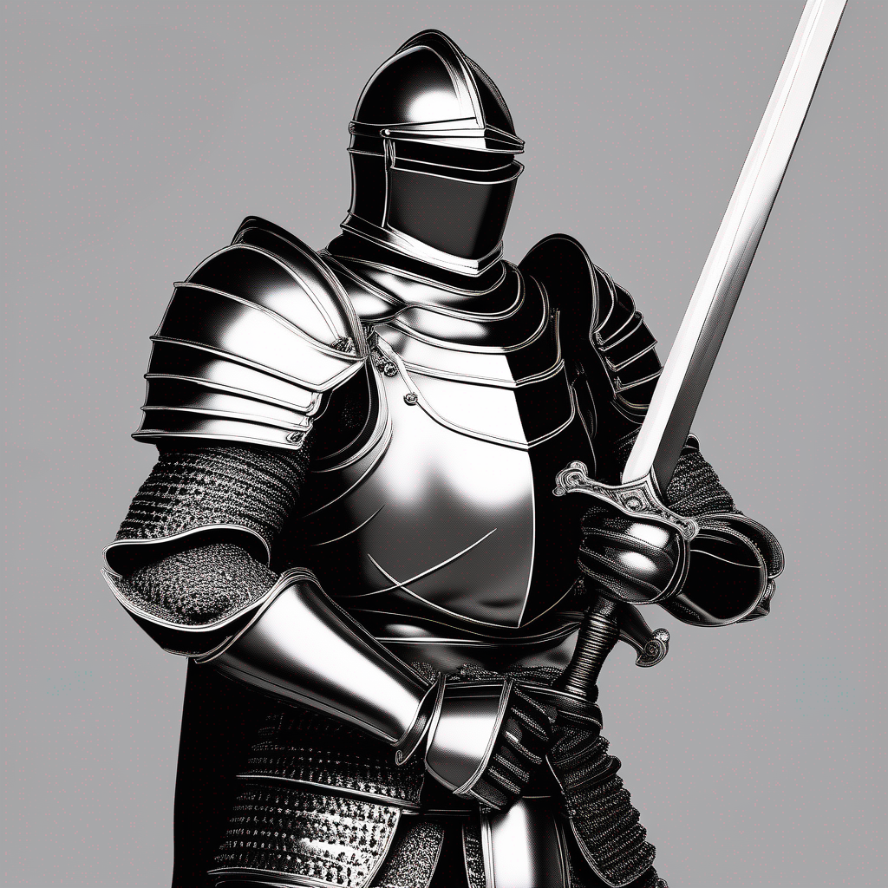

# DPO-SDXL Cog

This is an implementation of [DPO - SDXL](https://huggingface.co/mhdang/dpo-sdxl-text2image-v1) as a [Cog](https://github.com/replicate/cog) model.

## Development

Follow the [model pushing guide](https://replicate.com/docs/guides/push-a-model) to push your own fork of SDXL to [Replicate](https://replicate.com).

## Basic Usage

for prediction,

    cog predict -i prompt=""Armored knight holding sword"

